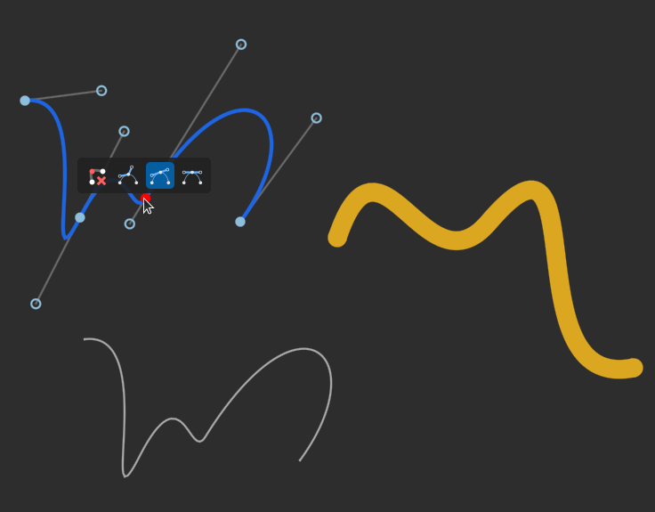

Interactive Shape Drawing for Godot
===================================

This is an addon for the Godot Game Engine. It should work with all
versions >= 4.0.

The addon provides the InteractiveCurve2D node. Once you've copied the addon to
your project, you should find a new InteractiveCurve2D node in the editor's
node creation dialog.

The InteractiveCurve2D node lets you display Curve2D objects and interactively
manipulate these objects inside your running application. It's main purpose is
the interactive handling of Bézier curves.

**Note**: It is **not** a tool meant for use directly in the Godot Editor.
The Godot Editor already has a UI for manipulating curves where necessary.

Demonstration Scene
-------------------

The addon includes a demonstration scene. You can find it under

`addons/InteractiveShapes2D/demo.tscn.`

Bugs
----

Make sure to read the comments on the current limitations of the signals provided
in `demo.gd` before you file bug reports concerning these. 

